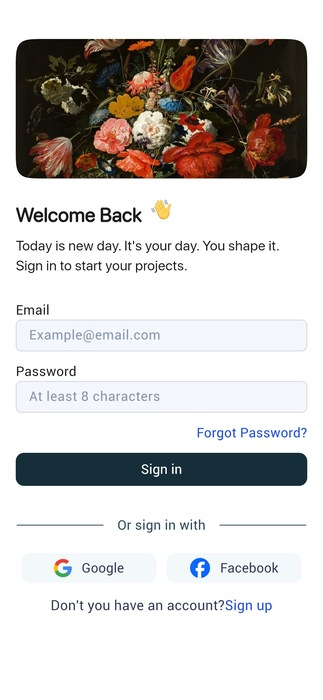
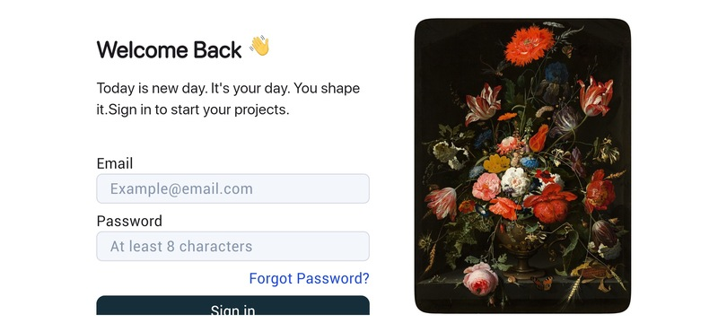
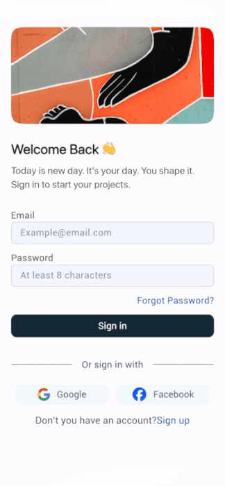
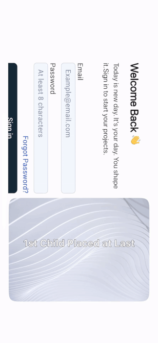

# AdaptiveLinearLayout

[](https://pub.dev/packages/adaptive_linear_layout)
[](https://pub.dev/packages/adaptive_linear_layout)
[](https://pub.dev/packages/adaptive_linear_layout)

**AdaptiveLinearLayout** dynamically switches between `Row` and `Column` based on screen orientation, with optional reversal of child order.

---

## How It Works

Depending on the `layoutPreference` and the current screen dimensions:

- If `LayoutPreference.Row` is selected:
  - Portrait: uses `Row`
  - Landscape: uses `Column`
- If `LayoutPreference.Column` is selected:
  - Portrait: uses `Column`
  - Landscape: uses `Row`

---

## 🎛️ Parameters

| Parameter              | Type                    | Default                   | Description                                      |
|------------------------|-------------------------|---------------------------|--------------------------------------------------|
| `children`             | `List<Widget>`          | —                         | Required list of widgets                        |
| `layoutPreference`     | `LayoutPreference`      | `LayoutPreference.row`    | Which layout to prefer in portrait mode         |
| `reverseDirection`     | `ReverseDirection`      | `ReverseDirection.none`   | Whether to reverse child order                  |
| `spacing`              | `double`                | `0.0`                     | Space between children                          |
| `mainAxisAlignment`    | `MainAxisAlignment`     | `MainAxisAlignment.start` | Horizontal/vertical alignment                   |
| `crossAxisAlignment`   | `CrossAxisAlignment`    | `CrossAxisAlignment.center` | Cross alignment                                |
| `mainAxisSize`         | `MainAxisSize`          | `MainAxisSize.max`        | Main axis size                                  |
| `textDirection`        | `TextDirection?`        | `null`                    | Row layout text direction                       |
| `verticalDirection`    | `VerticalDirection`     | `VerticalDirection.down`  | Column layout direction                         |
| `textBaseline`         | `TextBaseline?`         | `null`                    | Text baseline (for alignment if needed)         |

---

## 📚 Enums

### LayoutPreference

```dart
enum LayoutPreference {
  row,    // Portrait = Row, Landscape = Column
  column  // Portrait = Column, Landscape = Row
}
```

### ReverseDirection

```dart
enum ReverseDirection {
  row,      // Reverse in Row mode
  column,   // Reverse in Column mode
  none      // Do not reverse
}
```

---

## 📦 Installation

Add this to your `pubspec.yaml`:

```yaml
dependencies:
  adaptive_linear_layout: ^0.0.6
```

Then run:

```bash
flutter pub get
```

---


## Let’s Understand With Actual Example

**Desired UI**

### 1. Portrait Layout
> On Portrait Screen the first child (image) is on top and the second child (container) is below it.



---

### 2. Landscape/Desktop Layout
> On Landscape/Desktop Screen the image is on the right, container on the left.



---

### 3. Row -> Column Switch
> If `LayoutPreference.Row` is selected, it will be a Row in portrait and Column in landscape. The first element in Row appears left in portrait, but in Column mode it moves to last; we want it last in column.


  
---

### 4. Last Image in Row
> If we put the image last in Row, it appears last in Column (correct for landscape), but in Row layout it fails since the image should be first.



---

### 5. Custom ReverseDirection
> By choosing `ReverseDirection.Row` or `ReverseDirection.Column`, we get our customized behavior.


---

## ☕ Support Me

If you find my work useful, consider supporting me:

[](https://buymeacoffee.com/shahnawazsx)

---

## 🙏 Credits

Special thanks to [**Marwan**](https://www.figma.com/@MMarwan?fuid=1518655903515858290)  
for the original [Login UI Template on Figma](https://www.figma.com/design/Q9MAaLfWaffLHsjQlKY2ey/Login-Page--Community-).

This layout and logic was inspired by his beautiful design work 💙

---

## License

MIT © Shahnawaz Khan
